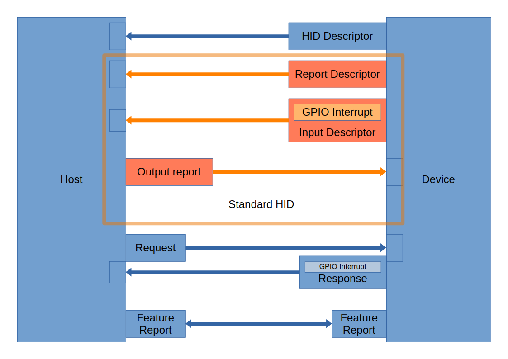

# about HID over i2c

HID is a standard first designed to work with USB, but more brodly has been used in i2c/bluetooth and other prodicals to handle generic HID events.  

In the image above you can see the orange parts which the parts where for the most part the messages are just plane HID events.  The rest of the messages are added to accommodate the different communication structure I2C has.  

* note - that even if the arrow is pointing from device to host.  Since this is I2C the host has to initiate the communication.  
    * You can notify that you have data to be processed using a gpio pin to notify the host that you have data.

## programming
* openocd -f interface/cmsis-dap.cfg -f target/rp2040.cfg -c "program i2c_example.elf verify reset exit"

## I2C notes
* https://learn.adafruit.com/scanning-i2c-addresses/raspberry-pi
* in pi configuration - interfaces - enable I2C
* i2cdetect -y 1

## Examples code I2C-HID microcontroller
* https://github.com/NordicPlayground/nrf52-i2c-hid-demo
* https://github.com/benedekkupper/stm32-i2c-hid/tree/master/stm32-i2c-hid

## pi device tree
* working device tree file 
    * https://github.com/NordicPlayground/nrf52-i2c-hid-demo/blob/master/Raspbian/i2c_hid-bcm2708-overlay.dts
* https://forums.raspberrypi.com/viewtopic.php?t=152803
    * Give a example on how it should look
* https://www.kernel.org/doc/Documentation/devicetree/bindings/input/hid-over-i2c.txt
    * HID doc from the kernel
* https://chromium.googlesource.com/chromiumos/third_party/kernel/+/chromeos-4.4/drivers/hid/i2c-hid/i2c-hid.c
    * i2c-hid.c
* https://blog.stabel.family/raspberry-pi-4-device-tree/
    * shows you how to debug device tree terminal
* Get pinout of pin
    * pinout

### Steps to add overlay 
compile and move to overlays

* dtc -@ -H epapr -O dtb -o i2cHID.dtbo i2c_hid.dts
* sudo cp i2cHID.dtbo /boot/overlays
* - Edit /boot/firmware/config.txt 
* - dtoverlay=i2cHID

After this all you need to do is cp the i2cHID.dtbo over to the /boot/overlays folder

## linux hid notes
* /sys/bus/hid/devices/
    * this is where the hid descriptors and driver stuff live
    * All HID descriptors will be there i2c and USB probably Bluetooth
* /sys/bus/i2c/devices - find HID devices
* uevents at the root will give you the name of the device

### linux tools
* somtimes the i2c tool doesn't do a full scan
    * i2cdetect -y -r 0
    * UU means reserved address 
* sudo vclog -m
    * You can see how things get loaded into the device tree
* sudo modprobe i2c_hid debut = 1
    * not sure this help since this modifies it after the fact
* dmesg | grep i2c_hid
    * helpful for finding errors how your doing hid i2c
* dmesg | grep -i hid
    * helpfull for figuring out problems with hid descriptor
* sudo evtest /dev/input/eventX
    * x being the number, can't directly look at the mouse pointer 
    * only mice

# hints
* to force it to stop interrupting all the time you hold the interupt pin high in the current configuration 